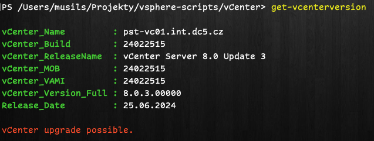

# vSphere scripts collection

## Description

This repository contains scripts for managing vSphere environment.

## Requirements

* You need to have PowerShell installed on your machine.
* You need to have PowerCLI installed on your machine to run these scripts.
* You need to have access to vCenter or ESXi host.
* You need to have permissions to run these scripts.
* You need to be connected to vCenter or ESXi host.

## ESXi hosts

### ESXi Description

[ESXi](./ESXi) folder contains scripts for managing ESXi hosts.

* List ESXi DNS servers
* start/stop SSH service on ESXi

## vCenter

### vCenter Description

[vCenter](./vCenter) folder contains scripts for managing vCenter.

* Alarm SSH enabled on ESXi [create_vcenter_alarm-esxi_shell_enabled.ps1](vCenter/create_vcenter_alarm-esxi_shell_enabled.ps1)
* Alarm ESXi shell enabled [create_vcenter_alarm-ssh_enabled.ps1](vCenter/create_vcenter_alarm-ssh_enabled.ps1)
* Find VM with specific MAC address [find_vm_with_MAC.ps1](vCenter/find_vm_with_MAC.ps1) and as function [get-mac-address-function.ps1](vCenter/get-mac-address-function.ps1)
* Get full vCenter version, release date etc.

## Virtual Machines

### VM Description

[VM](./VM) folder contains scripts for managing virtual machines.

* VM boot delay to 7sec. [VM-boot-delay.ps1](VM/VM-boot-delay.ps1)

## Powershell & PowerCLI environment

* Set Execution policy [set_powershell_execution_policy.ps1](set_powershell_execution_policy.ps1)
* Install PowerCLI [set_powercli_environment.ps1](set_powercli_environment.ps1)
