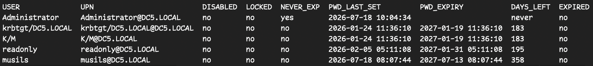

# sso-users

`sso-users` is a small Go CLI that lists vCenter SSO users and their password expiry information from VMware Directory Service (`vmdir`) over LDAPS.

It is intended for VCF 9 / vCenter SSO environments where you want the data without depending on PowerCLI or the `VMware.vSphere.SsoAdmin` PowerShell module.

## What It Reads

The tool connects to `ldaps://<vcenter>:636`, binds as an SSO administrator, and reads local SSO users from:

```text
cn=users,<domain DN>
```

Password expiry is computed from vmdir attributes:

| Attribute | Meaning |
| --- | --- |
| `pwdLastSet` | Password last-set timestamp, in seconds since Unix epoch |
| `vmwPasswordNeverExpires` | Per-user password never expires flag |
| `vmwPasswordLifetimeDays` | Domain password lifetime policy, read from `cn=password and lockout policy,<domain DN>` |
| `userAccountControl` | Account state flags used for disabled/locked status |

The expiry calculation is:

```text
PasswordExpiry = pwdLastSet + vmwPasswordLifetimeDays
```

If `vmwPasswordNeverExpires` is `TRUE`, or if `vmwPasswordLifetimeDays` is `0` or missing, the password is treated as never expiring.

## Requirements

- Go 1.22 or newer
- Network access to vCenter / PSC LDAPS port `636`
- SSO administrator credentials, for example `administrator@vsphere.local`
- Trusted vCenter certificate, or `-insecure` for internal self-signed certificates

## Build

From this directory:

```bash
go mod tidy
go build -o sso-users .
```

Or use the app-local Makefile:

```bash
make build
```

The generated binary `apps/sso-users/sso-users` is ignored by Git.

Show the application version:

```bash
./sso-users -version
```

## Release Builds

Prebuilt binaries are produced by GitLab CI when a tag matching `sso-users/vX.Y.Z` is pushed.

Supported release targets:

| OS | Architecture | Archive |
| --- | --- | --- |
| macOS | `arm64` | `sso-users_X.Y.Z_darwin_arm64.tar.gz` |
| Linux | `amd64` | `sso-users_X.Y.Z_linux_amd64.tar.gz` |
| Windows | `amd64` | `sso-users_X.Y.Z_windows_amd64.zip` |

The release also includes `checksums.txt` with SHA256 checksums.

Create a release from this repository root:

```bash
version="$(cat apps/sso-users/VERSION)"
git tag "sso-users/v${version}"
git push origin "sso-users/v${version}"
```

Build the same release archives locally:

```bash
make release
```

Release archives are written to `apps/sso-users/dist/`. The `dist/` directory and compiled binaries are build artifacts and should not be committed.

## CLI Usage

Prompt for the password interactively:

```bash
./sso-users -server vcsa.example.local -user administrator@vsphere.local
```

For vCenters with a self-signed or otherwise untrusted certificate:

```bash
./sso-users -server vcsa.example.local -user administrator@vsphere.local -insecure
```

Use a non-default SSO domain:

```bash
./sso-users -server vcsa.example.local -domain dc5.local -user administrator@dc5.local -insecure
```

Export CSV:

```bash
./sso-users -server vcsa.example.local -insecure -csv sso-users.csv
```

Output JSON:

```bash
./sso-users -server vcsa.example.local -insecure -json
```

The JSON output is intentionally stable because the HTTP API uses the same record structure.

## HTTP Server Usage

Run the HTTP server:

```bash
./sso-users serve \
	--server vcsa.example.local \
	--insecure \
	--listen :8080 \
	--apikey secret
```

The server runs until it is stopped. It uses the same LDAP connection flags and password handling as the CLI mode, then exposes the data through HTTP. Startup fails when `-server` or `-apikey` is missing.

To avoid putting the LDAP bind password in shell history, prefer `SSO_BIND_PASSWORD`:

```bash
export SSO_BIND_PASSWORD='your-temporary-password'
./sso-users serve \
	--server vcsa.example.local \
	--insecure \
	--listen :8080 \
	--apikey secret
unset SSO_BIND_PASSWORD
```

Health check:

```bash
curl http://localhost:8080/health
```

Authenticated users endpoint:

```bash
curl \
	-H "Authorization: Bearer secret" \
	http://localhost:8080/api/v1/users
```

`/api/v1/users` returns the same JSON fields and formatting as the CLI JSON output.

## Password Handling

Password sources are evaluated in this order:

1. `-password` flag
2. `SSO_BIND_PASSWORD` environment variable
3. Interactive no-echo prompt

Prefer the interactive prompt or `SSO_BIND_PASSWORD`. Avoid `-password` in normal use because command-line arguments can be visible in process lists and shell history.

Example with environment variable:

```bash
export SSO_BIND_PASSWORD='your-temporary-password'
./sso-users -server vcsa.example.local -user administrator@vsphere.local -insecure
unset SSO_BIND_PASSWORD
```

## CLI Flags

| Flag | Default | Description |
| --- | --- | --- |
| `-server` | required | vCenter / PSC host running vmdir |
| `-port` | `636` | LDAPS port |
| `-domain` | `vsphere.local` | SSO domain name |
| `-user` | `administrator@vsphere.local` | SSO admin bind user |
| `-password` | empty | Bind password; prefer prompt or `SSO_BIND_PASSWORD` |
| `-insecure` | `false` | Skip TLS certificate verification |
| `-csv` | empty | Export results to CSV |
| `-json` | `false` | Print JSON instead of a table |
| `-version` | `false` | Print version and exit |

## HTTP Server Flags

Use `./sso-users serve` with these server-specific flags:

| Flag | Default | Description |
| --- | --- | --- |
| `-listen` | `:8080` | HTTP listen address and port |
| `-apikey` | required | API key required in `Authorization: Bearer <apikey>` |

The `serve` command also accepts the same LDAP flags as CLI mode: `-server`, `-port`, `-domain`, `-user`, `-password`, and `-insecure`.

Go's standard flag parser accepts both single-dash and double-dash forms, so `-apikey secret` and `--apikey secret` are equivalent.

## HTTP API

### GET /health

Does not require authentication. Returns HTTP 200:

```json
{"status":"ok"}
```

Response headers include:

```text
Content-Type: application/json
```

### GET /api/v1/users

Requires:

```text
Authorization: Bearer <apikey>
```

On success, returns HTTP 200 with `Content-Type: application/json` and the same JSON as CLI mode with `-json`:

```bash
./sso-users -server vcsa.example.local -insecure -json
```

The endpoint does not add or remove fields. It uses the same business logic as the CLI, so LDAP lookup behavior, password expiry calculation, and bind fallback are shared. Each authenticated request reads current data from vmdir.

Only `GET` is implemented for the HTTP API. Unsupported methods are returned as `404 Not Found`.

### HTTP Status Codes

| Endpoint | Condition | Status |
| --- | --- | --- |
| `/health` | Health check succeeds | `200 OK` |
| `/api/v1/users` | API key is missing or invalid | `401 Unauthorized` |
| `/api/v1/users` | LDAP lookup fails | `500 Internal Server Error` |
| Any other path or unsupported method | Endpoint or method is not served | `404 Not Found` |

### Logging

The HTTP server logs startup, incoming requests, HTTP status codes, request duration, and LDAP/read errors through Go's standard `log` package.

It does not log API keys, `Authorization` headers, or LDAP bind passwords.

## Output

Example output from a VCF 9 / vCenter SSO environment:



Default table columns:

| Column | Description |
| --- | --- |
| `USER` | Local SSO account name |
| `UPN` | User principal name |
| `DISABLED` | Account disabled flag from `userAccountControl` |
| `LOCKED` | Account lockout flag from `userAccountControl` |
| `NEVER_EXP` | Password never expires flag |
| `PWD_LAST_SET` | Password last-set timestamp |
| `PWD_EXPIRY` | Computed password expiry timestamp |
| `DAYS_LEFT` | Remaining days, or `never` |
| `EXPIRED` | Whether the password is already expired |

## Bind Behavior

The tool first tries to bind with the supplied `-user` value. If the value looks like a UPN and vmdir returns invalid credentials, it retries with a derived DN:

```text
cn=<local-part>,cn=users,<domain DN>
```

For example:

```text
administrator@vsphere.local -> cn=administrator,cn=users,dc=vsphere,dc=local
```

If both attempts fail with LDAP result code `49`, verify the password, account lockout state, and the SSO domain.

## Troubleshooting

### LDAP Result Code 49: Invalid Credentials

Common causes:

- Wrong password
- Wrong SSO domain in `-domain`
- Account is locked or disabled
- The account is not in `cn=users,<domain DN>` and the derived DN fallback does not match

Try a full DN explicitly:

```bash
./sso-users -server vcsa.example.local -user 'cn=Administrator,cn=users,dc=vsphere,dc=local' -insecure
```

### TLS Certificate Error

Use `-insecure` for internal tests, or add the vCenter certificate/CA to the system trust store.

```bash
./sso-users -server vcsa.example.local -insecure
```

### No Users Returned

Verify the SSO domain and base DN. For `vsphere.local`, the base DN is:

```text
dc=vsphere,dc=local
```

The current implementation searches one level under:

```text
cn=users,dc=vsphere,dc=local
```

If your environment stores local users elsewhere, adjust the search base in `readUsers`.

## Security Notes

- Do not commit `.env` files or credentials. The repository ignores `.env` files.
- Prefer short-lived or temporary credentials for testing.
- Rotate any password that was pasted into chat, terminal history, or logs.
- The HTTP server logs requests and statuses, but does not log API keys, Authorization headers, or LDAP passwords.
- `-insecure` disables TLS certificate validation; use it only for trusted internal environments.

## Versioning

The single source of truth for the app version is `VERSION`. The binary embeds this file and prints it with:

```bash
./sso-users -version
```

When changing app behavior or build logic:

1. Bump `VERSION`.
2. Update `CHANGELOG.md`.
3. Run `make check`.
4. Build with `make build`.
5. Verify `./sso-users -version`.

`make check-version` uses the Git working tree to catch code/build changes under `apps/sso-users/` when `VERSION` or `CHANGELOG.md` were not updated. README-only changes do not require a version bump.
